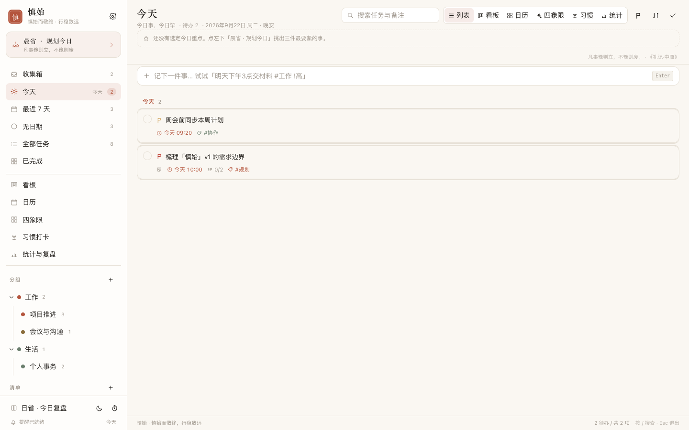
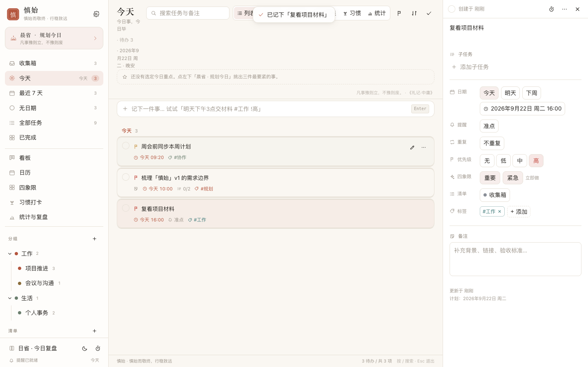
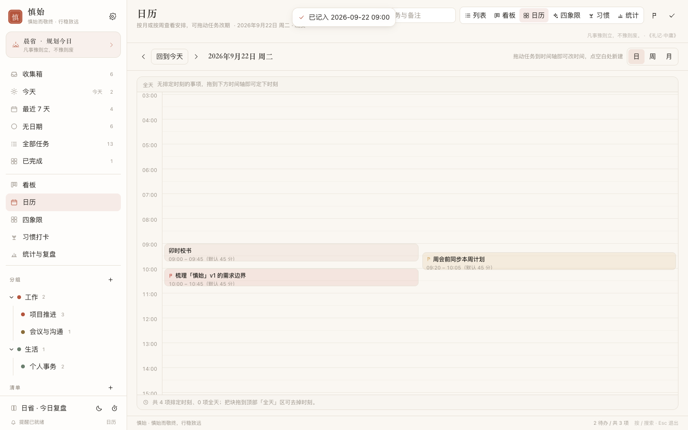
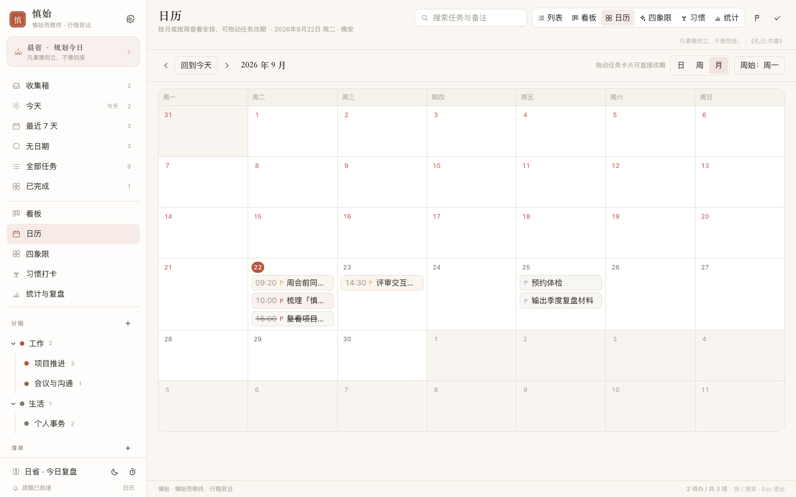
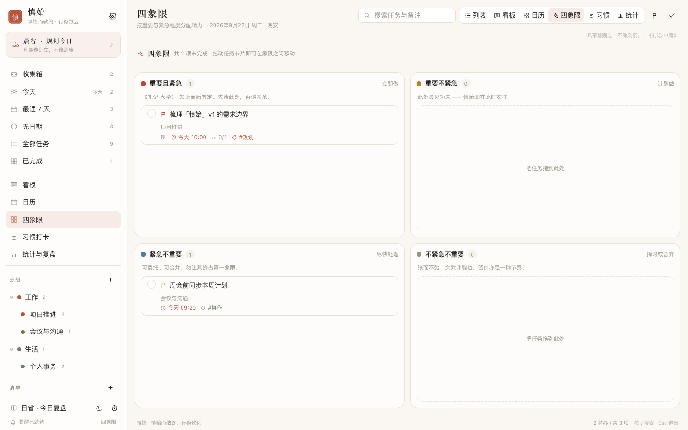
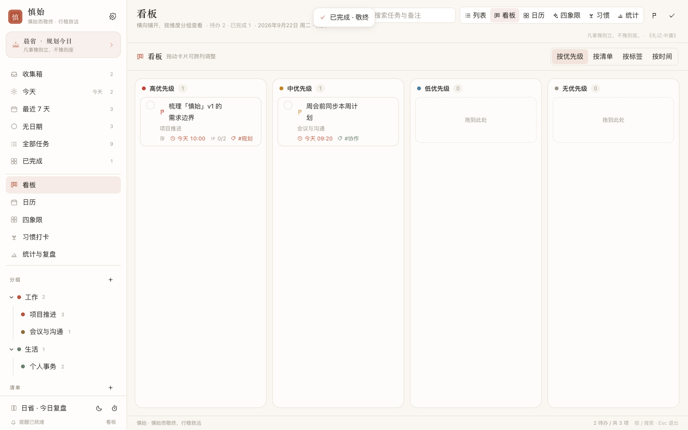
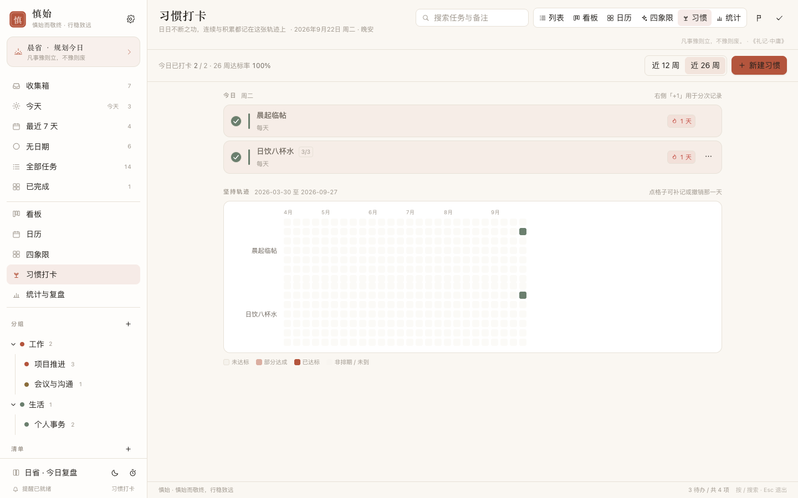
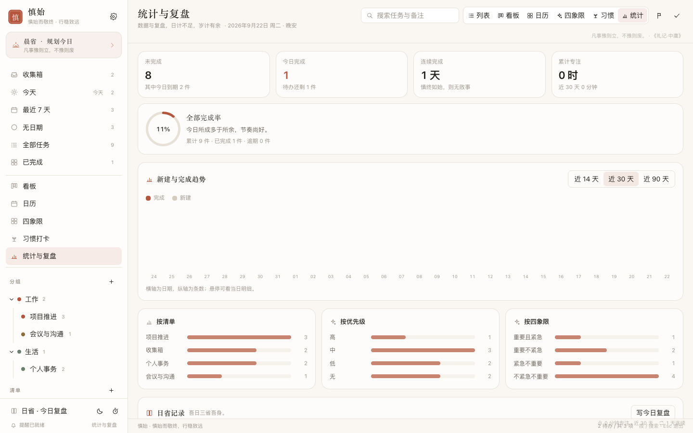
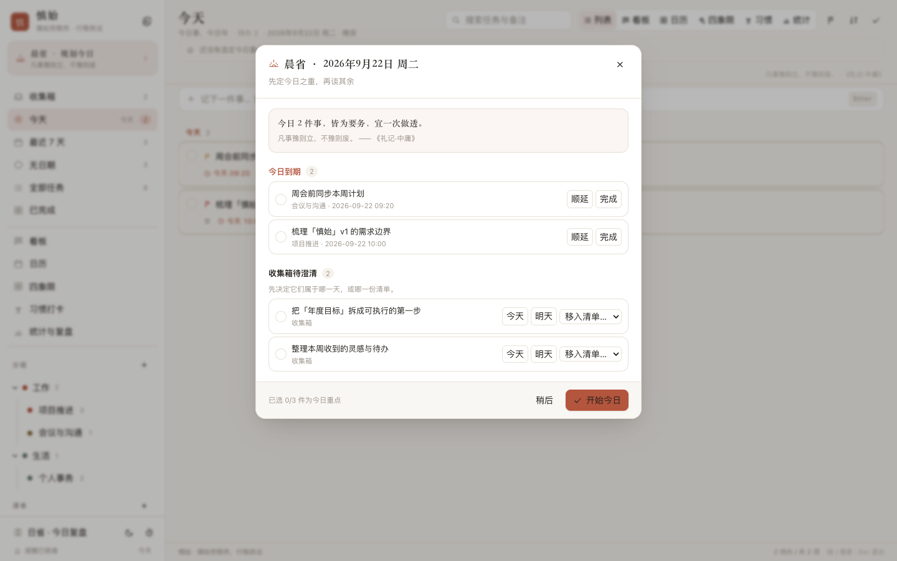

# 慎始

> 慎始而敬终，行稳致远。 —— 《礼记》义疏

一个专注「规划与善始善终」的任务管理应用。名字取自《礼记》「慎始而敬终」：开始要慎重，收尾同样要敬重。
复刻滴答清单一类的成熟任务管理器的核心能力，但把「规划 → 执行 → 复盘」的闭环做成主线，而不是堆功能。

技术栈：**Go 1.27 标准库 + 内嵌 SQLite（纯 Go，无 cgo） + React 19 / Vite 8 / TypeScript 7 / Tailwind v4**。
构建产物是**单个可执行文件**（前端经 `go:embed` 打进二进制），运行时只需要它和一个 `.db` 文件。



---

## 工具链版本

| 用途 | 版本 | 声明位置 |
| --- | --- | --- |
| 前端构建 / 运行 | **Node 24** | `.nvmrc`、`web/package.json` 的 `engines`、`Dockerfile` 的 `node:24-alpine` |
| 后端构建 / 运行 | **Go 1.27** | `server/go.mod` 的 `go 1.27.1`、`Dockerfile` 的 `golang:1.27-alpine` |
| 最终镜像基础层 | **Alpine 3.24** | `Dockerfile` |

```bash
nvm use            # 读 .nvmrc，切到 Node 24
```

`scripts/build.sh` 会在 PATH 上找不到合规版本时，自动到 nvm / Homebrew 里找
Node 24 与 Go 1.27，并把实际用到的版本打印出来；也可用 `NODE_BIN` / `GO_BIN` 显式指定。

---

## 快速开始

```bash
# 一键构建：前端 → server/dist → 内嵌进二进制
./scripts/build.sh

# 运行（默认 http://localhost:8787）
./bin/shenshi

# 指定端口与数据文件
./bin/shenshi -addr :9000 -db data/my.db
```

首次启动会自动建表并写入一组演示数据（工作 / 生活两个分组、收集箱、几条带典籍引文的任务）。
数据文件默认在 `data/shenshi.db`，也可用环境变量 `SHENSHI_DB` 指定。

### 开发模式

```bash
cd server && go run . -web ../web/dist   # 后端 + 磁盘上的前端产物
cd web && npm run dev                    # 前端热更新，/api 自动代理到 :8787
```

---

## 部署到服务器（Docker）

```bash
cp .env.example .env        # 在 .env 里填一个访问口令
docker compose up -d --build
```

然后多端（电脑 / 手机 / 平板）打开 `http://<服务器地址>:8787` 即可，数据由服务端统一维护。

**访问口令**由 `SHENSHI_TOKEN` 决定，是本项目唯一的一道门：

- 留空 = 不启用鉴权，只适合完全可信的内网；启动日志会明确提示这一点。
- 设置后：未登录访问任何路径（含前端页面）都会先看到登录页；口令正确才下发一个
  HttpOnly Cookie，之后所有请求凭 Cookie 放行。也接受 `Authorization: Bearer <token>`
  与 `?token=<token>` 两种方式，方便脚本与快捷方式。
- 口令比对走常量时间比较；连续输错 8 次会把该来源锁 5 分钟（429），避免被慢慢试。
- `/api/health` 与 `/api/auth/*` 免鉴权：前者供容器探活，后者是登录本身。

生成口令：

```bash
openssl rand -base64 24
```

**数据落在具名卷 `shenshi-data`**（容器内 `/data/shenshi.db`）。备份有两条路：
应用内「导出 JSON 备份」；或直接取卷里的文件：

```bash
docker run --rm -v shenshi-data:/data -v "$PWD:/backup" alpine \
  cp /data/shenshi.db /backup/shenshi-$(date +%F).db
```

**时区很要紧**：`TZ` 直接决定「今天」「逾期」「习惯打卡」算在哪一天。
镜像里已装 tzdata 并默认 `Asia/Shanghai`，换时区改 `.env` 的 `TZ` 即可。

镜像用三阶段构建（`node:24-alpine` 构建前端 → `golang:1.27-alpine` 编译 → `alpine:3.24` 运行），
最终约 20MB，只含一个静态链接的二进制、tzdata 与根证书；编译工具链与 `node_modules` 都不进最终镜像。
由于 SQLite 驱动是纯 Go 实现，构建期 `CGO_ENABLED=0`，可交叉编译到 `amd64` / `arm64`。

推送到 `main` 后，CI 会把多架构镜像发布到 GitHub 容器仓库，服务器上可以直接拉现成的：

```bash
docker pull ghcr.io/felix2yu/shenshi:latest
```

---

## 持续集成

`.github/workflows/` 下两个工作流（结构参考 [Felix2yu/mujian](https://github.com/Felix2yu/mujian/tree/main/.github)）。

**`build.yml`** —— 推送 / PR / 手动 / **每周一 03:00 UTC 定时**触发：

| 步骤 | 内容 |
| --- | --- |
| `test` | 前端类型检查 → `build.sh` → 后端冒烟 184 项 → 浏览器 UI 冒烟 78 项（失败时截图作为 artifact 上传） |
| `docker` | 仅 `main`：`amd64` / `arm64` 各自在**原生 runner** 上构建并推到 `ghcr.io` |
| `docker-manifest` | 把两个架构合成多架构 manifest（`latest` 与 `<sha>`） |

**`release.yml`** —— 在 GitHub 上发布 release 时，交叉编译 `linux/darwin × amd64/arm64` 四个二进制，
连同 `SHA256SUMS.txt` 挂到该 release 上。

**`.github/dependabot.yml`** —— 每周五检查依赖更新并开 PR：`gomod`（`/server`）、
`npm`（`/web`）、`docker`（基础镜像）、`github-actions`（工作流里用到的 action）。

> **关于 runner 选择**：`ubuntu-24.04` / `ubuntu-24.04-arm` 是**显式钉死**的，不用 `-latest`。
> `-latest` 已经静默换过底层镜像，而这类漂移只在出问题时才被发现。本项目的二进制是静态的、
> 不受 glibc 影响，钉版本主要是为了让「CI 跑在什么环境上」这件事保持可预期。
>
> 另外，`CGO_ENABLED=0` 让所有目标平台都能在**同一个 Linux runner** 上交叉编译出来，
> 所以这里不需要为每个平台开独立 runner —— 那是 CGO 项目才有的负担。

---

## 功能

### 1. 任务创建与编辑

- **自然语言快速添加**：`明天下午3点 交季度材料 #工作 !高` —— 一键识别日期、时间、标签、优先级，
  并在输入框下方实时预览识别结果（`今天` `/项目推进` `@重要@紧急` `!高` `每天` 等写法均支持）
- 任务详情面板：子任务（带完成进度）、备注、优先级、四象限、日期与时间、提醒、重复规则、标签、清单、专注计时
- 行内改标题、勾选完成、右键菜单式操作，删除前有确认
- **多选批处理**：批量完成 / 恢复 / 改期 / 移清单 / 删除
- **手动排序**：工具栏切换「排序方式」（智能 / 手动 / 优先级 / 到期 / 创建 / 标题）；
  手动模式下每行出现拖拽手柄，拖完即落库（`sort_order` 按 1024 的间隔排布，留出插入余量）
- 搜索：标题与备注全文匹配



### 2. 清单与分组

- 分组（工作 / 生活…）→ 清单 → 任务三层结构，支持拖动、折叠、改名、配色、删除
- **收集箱**：还没想好归属的想法先落到这里，之后再归位（收集箱不可删除）
- 智能清单：收集箱 / 今天 / 最近 7 天 / 逾期 / 无日期 / 全部 / 已完成，角标实时反映未完成数量
- 标签：独立维度，跨清单横向串联任务，可配色、改名、删除
- 侧栏的分组与清单可直接拖动排序（与拖动任务互不干扰：拖动时会阻止事件冒泡）

### 3. 智能提醒

- 服务端扫描到期任务（`/api/reminders/due`），按「准点 / 提前 5、30、60 分钟 / 提前 1 天」等偏移触发
- 台账去重（`reminder_log`）：同一条提醒只投递一次，可一键重置
- 浏览器桌面通知 + 应用内合成提示音（WebAudio，无需音频资源）
- **提醒中心**：集中处理待办提醒，可「查看 / 5 分钟后 / 30 分钟后 / 忽略」

### 4. 日历与时间视图

- 月视图 / 周视图 / **日视图**切换，周起始日可设为周一或周日
- **拖动任务卡片改期**，直接落日期
- 格内快速添加（在指定日期直接写下一件事）
- 「无日期」待办侧栏，方便把游离事项安排进日程
- **日视图时间轴**：24 小时纵轴，任务按 `dueTime`–`endTime` 成块排布，时间重叠的任务自动并排分道；
  点时间轴空白处按 15 分钟吸附就地点建，拖动任务块即可改时刻，拖回顶部「全天」区即撤销时刻





### 5. 标签与优先级

- 优先级 无 / 低 / 中 / 高，列表内以旗帜色标区分
- 工具栏筛选：按优先级、按标签过滤任意视图
- 四象限（艾森豪威尔矩阵）：重要 × 紧急，四个象限可直接拖拽改写
  「重要」由优先级推导、「紧急」由到期时间推导，也可在详情里手工覆写



- 看板视图：按 优先级 / 清单 / 标签 / 时间 四种维度分组，跨列拖动即改属性



### 6. 重复任务

自建紧凑规则语法，由后端 `NextOccurrence()` 统一解释：

| 规则 | 含义 |
| --- | --- |
| `daily` | 每天 |
| `weekly:1,3,5` | 每周一 / 三 / 五 |
| `monthly:last` | 每月最后一天 |
| `monthly:15` | 每月 15 号（日期不存在时自动收敛到月末） |
| `every:2:day` | 每 2 天 |
| `ebbinghaus:0` | 艾宾浩斯复习曲线：1、2、4、7、15、30、60 天后 |

完成一个重复任务时自动生成下一次实例，并把当前实例标记完成。

**跳过本次**：如果这次不必做（例如本周例会取消），可以直接跳过 —— 只把日期推到下一次，
既不记为完成，也不生成副本。菜单里与「完成」严格区分，避免连续坚持的记录被污染。

### 7. 习惯打卡

任务与习惯分开建模：任务做完就结束，习惯只在时间里长出来。

- **节奏**：每天，或按周指定星期（内置「每天 / 工作日 / 周末」快捷预设）
- **达标次数**：一天要记 N 次才算达标（如「日饮八杯」），可一次记满也可 `+1` 累加
- **连续天数**：当前连续与历史最长连续；今天还没打卡不算断档，从昨天回数
- **补记**：点热力图的任意格子即可补记或撤销那一天，起始日之前的补记同样计入连续
- **热力图**：12 / 26 周（默认半年）周为列、星期为行，四种状态一目了然 —— 已达标 / 部分达成 / 未达标 / 非排期
- **达标率**：以「应做日」为分母，只统计起始日之后、今天之前的排期日，不虚增欠账
- 支持归档（不再显示）与删除（打卡记录级联删除，需二次确认）



### 8. 数据管理

- **导出**：JSON 全量备份（分组 / 清单 / 任务 / 标签 / 复盘 / 专注 / 习惯与打卡流水 / 设置）与
  任务表 CSV（带 BOM，Excel 直接打开不乱码）
- **导入**：`merge` 把备份作为副本追加（分组与标签按名称合并，习惯流水重挂到新 id），
  `replace` 清空后按原 id 精确复原，用于灾难恢复
- 导出走进浏览器附件下载，导入前有二次确认

### 9. 理念功能：让「善始善终」落到交互里

- **晨省 · 规划今日**：每天首次打开时引导，从逾期 / 今日 / 收集箱里挑出**三件最要紧的事**
  （《礼记·中庸》「凡事豫则立，不豫则废」）
- **今日三件事**：选中的重点固定显示在今日视图顶部，随时可见完成进度
- **日省 · 今日复盘**：晚间引导记录 做成了什么 / 卡在哪 / 明天先做什么（《论语》「吾日三省吾身」）
- **专注计时**：25 分钟起，结束后把专注时长记入统计（《论语》「譬如为山，未成一篑」）
- **统计与复盘**：完成率环、连续完成天数、新建与完成趋势、按清单 / 优先级 / 四象限分布、历日复盘
- 每个空状态都配一句典籍原文与出处（`src/lib/quotes.ts`），界面本身承担理念表达




### 10. 界面

- 宣纸 / 松烟墨 / 朱砂印三色体系，纸面纹理与印章标记
- 浅色与深色主题、五种强调色，跟随系统偏好首次生效
- 桌面三栏（清单树 · 视图 · 详情），窄屏自动收为抽屉与整屏浮层
- 快捷键：`N` 新建 · `/` 搜索 · `T` 今天 · `I` 收集箱 · `C` 日历 · `Q` 四象限 · `B` 看板 · `H` 习惯 · `S` 统计 · `Esc` 退出

---

## 架构

```
shendu/
├── server/                       # Go 后端：REST API + 静态资源托管
│   ├── main.go                   # 入口、go:embed、SPA 回退
│   ├── internal/model/model.go   # 领域模型与时间序列化
│   ├── internal/store/           # 数据层（SQLite）
│   │   ├── store.go              # 建表、种子数据
│   │   ├── tasks.go              # 任务查询/写入、筛选与排序口径
│   │   ├── org.go                # 分组 / 清单 / 标签
│   │   ├── repeat.go             # 重复规则解释
│   │   ├── habits.go             # 习惯与打卡、连续天数与达标率
│   │   ├── backup.go             # 全量导出与导入（merge / replace）
│   │   ├── reminders.go          # 提醒调度与台账
│   │   └── stats.go              # 统计、复盘、专注
│   ├── internal/api/             # HTTP 层：路由、CORS、错误映射
│   └── dist/                     # 前端构建产物（由 build.sh 生成，供 embed）
├── web/                          # React 前端
│   └── src/
│       ├── App.tsx               # 三栏装配、全局快捷键
│       ├── store/AppStore.tsx    # 全局状态（乐观更新 + 对账）
│       ├── api/client.ts         # 接口封装
│       ├── lib/                  # 日期、自然语言解析、筛选、文案、通知
│       └── components/           # 视图与组件
└── scripts/
    ├── build.sh                  # 一键构建
    ├── smoke.py                  # 后端端到端冒烟（184 项）
    └── ui-smoke.mjs              # 真实浏览器 UI 冒烟（78 项）
```

CI 配置另在 `.github/`（`workflows/build.yml`、`workflows/release.yml`、`dependabot.yml`）。

**几处设计取舍**

- **单文件交付**：前端产物 `go:embed` 进二进制，省掉 Nginx 与跨域配置；开发时用 `-web` 指向磁盘目录即可热更新。
- **纯 Go SQLite**（`modernc.org/sqlite`）：不依赖 cgo，交叉编译与 CI 都简单；开启 WAL 与 `busy_timeout` 应对并发写。
- **筛选口径在后端**：智能清单（今天 / 最近 7 天 / 逾期…）由 SQL 条件驱动，不把全量数据拉到前端再过滤。
- **三态字段**：`Opt[T]` 区分「未传」与「显式置空」，PATCH 语义清晰（例如把 `dueDate` 置为 `null` 表示清空日期）。
- **角标与列表口径分离**：角标只统计未完成（`whereCount`），列表则保留「今日已完成」，勾掉的任务会沉到列表末尾的「已完成」分区，而不是凭空消失。
- **乐观更新 + 去抖对账**：勾选立即反馈，220ms 后统一与服务端对账并刷新角标。

---

## API

| 方法 | 路径 | 说明 |
| --- | --- | --- |
| GET | `/api/health` | 健康检查 |
| GET | `/api/bootstrap` | 首屏数据：分组、清单、标签、设置、角标 |
| GET | `/api/tasks` | 任务列表（`smart` / `listId` / `folderId` / `tagId` / `q` / `from` / `to` / `status` / `quadrant`） |
| POST | `/api/tasks` | 新建任务 |
| GET/PATCH/DELETE | `/api/tasks/{id}` | 读取 / 局部更新 / 删除 |
| POST | `/api/tasks/{id}/toggle` | 完成或恢复（重复任务自动续期） |
| POST | `/api/tasks/{id}/skip` | 跳过重复任务的本次发生（只推进到下一次） |
| POST | `/api/tasks/reorder` · PUT `/api/folders/reorder`、`/api/lists/reorder` | 拖拽排序落库 |
| POST | `/api/tasks/{id}/move` | 改期或改清单（拖拽用） |
| POST | `/api/tasks/batch` | 批量完成 / 恢复 / 删除 / 移动 |
| POST | `/api/tasks/{id}/subtasks` · PATCH/DELETE `/api/subtasks/{id}` | 子任务 |
| GET/POST · PATCH/DELETE | `/api/folders[/{id}]`、`/api/lists[/{id}]`、`/api/tags[/{id}]` | 分组 / 清单 / 标签 |
| POST | `/api/tags/ensure` | 按名称批量确保标签存在 |
| GET | `/api/habits` | 习惯看板（习惯 + 区间流水 + 统计，`from` / `to`） |
| POST · PATCH/DELETE `/api/habits[/{id}]` | 新建 / 更新 / 删除习惯 |
| PUT | `/api/habits/reorder` | 习惯排序 |
| POST · DELETE | `/api/habits/{id}/check` | 打卡（不传 `count` 为加一次，传 0 即撤销）/ 撤销打卡 |
| GET | `/api/export` · `/api/export/csv` | 全量 JSON 备份 / 任务表 CSV |
| POST | `/api/import?mode=merge\|replace` | 导入备份 |
| GET/PUT | `/api/settings` | 设置 |
| GET | `/api/stats` | 统计（趋势、连续天数、分布） |
| GET/PUT | `/api/reviews[/{date}]` | 日省复盘 |
| GET/POST | `/api/focus` | 专注时段 |
| GET | `/api/reminders/due` · POST `/api/reminders/ack`、`/reset` | 提醒投递与台账 |
| GET | `/api/meta/repeat` | 重复规则元数据 |

---

## 测试

```bash
# 后端端到端（自建临时实例与数据库，逐条验证核心接口）
python3 scripts/smoke.py

# 前端 UI（真实 Chromium，验证渲染、交互与运行时零报错）
cd web && npm ci
node scripts/ui-smoke.mjs
```

UI 冒烟脚本需要 Chromium，按以下顺序查找：`CHROMIUM_PATH` → `PLAYWRIGHT_BROWSERS_PATH` /
`~/.cache/ms-playwright`、`~/Library/Caches/ms-playwright` → 系统安装的 Chromium / Chrome。
本机若已有 Playwright 的浏览器缓存会直接复用；没有就装一份：

```bash
cd web && npx playwright-core install --with-deps chromium
```

两个脚本都不需要事先手动准备数据 —— 各自起临时实例与临时数据库，跑完即清理。

当前状态：后端 **184/184** 通过，前端 **78/78** 通过（含「无控制台错误 / 无未捕获异常」两项硬性检查）。
UI 冒烟脚本会把各视图截图写到 `SHOT_DIR`（默认 `/tmp/shenshi-shots`），便于人工复核；
CI 里该目录被改到仓库内并作为 artifact 上传，失败时可直接下载定位。

---

## 已知限制

- **单用户**：没有账号体系，`SHENSHI_TOKEN` 是一道全局门禁而非多用户隔离；多人共用同一份数据。
- 提醒依赖前端轮询（30 秒一次）：关闭页面则不会弹出桌面通知，需要常驻后台提醒时应另接系统级通知。
- 日历视图按月/周拉取数据，未做跨时区换算，一律按本机时区处理。
- 子任务仅一层，不支持无限嵌套。
